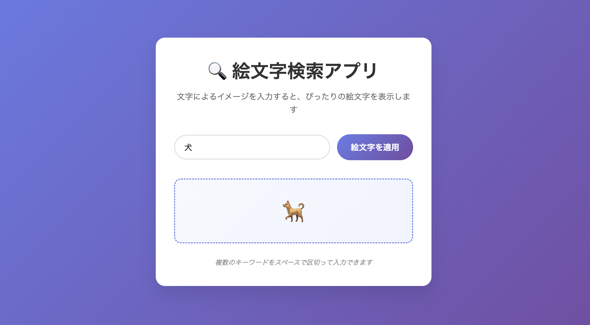

# 🔍 絵文字検索アプリ

日本語のキーワードを入力すると、対応する絵文字を返すシンプルな Web アプリケーションです。

## 📸 スクリーンショット



アプリ実行時の画面イメージ

## 🎯 概要 (Overview)

この Web アプリケーションの目的は、**文字によるイメージから絵文字への変換機能**を提供することです。

### 主な機能

- 🇯🇵 **日本語キーワード対応**: 感情、動物、食べ物、天気など幅広いカテゴリに対応
- 🔄 **複数キーワード処理**: スペース区切りで複数のキーワードを同時に変換
- 📱 **レスポンシブデザイン**: PC・スマートフォン両対応
- ⚡ **軽量**: フレームワークなし、純粋な HTML/CSS/JavaScript

## 🚀 インストール (Installation)

### 方法 1: 直接ブラウザで開く

1. このリポジトリをクローンまたはダウンロード

```bash
git clone <repository-url>
cd Claude-code-test-app
```

2. `index.html` をブラウザで直接開く

```bash
open index.html
```

### 方法 2: ローカルサーバーで実行

```bash
# Python 3の場合
python3 -m http.server 8000

# その後ブラウザで http://localhost:8000 にアクセス
```

## 📖 使用方法 (Usage)

1. テキストフォームに日本語のキーワードを入力
2. 「絵文字を適用」ボタンをクリック（または Enter キー）
3. 対応する絵文字が表示されます

### 入力例

```
入力: 悲しい お祝い
出力: 😢 🎉
```

```
入力: 犬 猫 うさぎ
出力: 🐕 🐱 🐰
```

```
入力: 寿司 ラーメン ケーキ
出力: 🍣 🍜 🍰
```

### 複数キーワードの使い方

- キーワードはスペースで区切って入力
- それぞれのキーワードに対応する絵文字が順番に表示
- 該当しないキーワードには「❓🤔」が表示

## 📚 絵文字辞書例 (Emoji Mapping)

現在 880 以上のキーワードに対応しています。以下は各カテゴリの例：

| カテゴリ     | キーワード例               | 絵文字   |
| ------------ | -------------------------- | -------- |
| **感情**     | 嬉しい、悲しい、怒り       | 😊 😢 😠 |
| **動物**     | 犬、猫、パンダ             | 🐕 🐱 🐼 |
| **食べ物**   | 寿司、ピザ、ケーキ         | 🍣 🍕 🍰 |
| **天気**     | 晴れ、雨、雪               | ☀️ 🌧️ ❄️ |
| **自然**     | 山、海、花                 | ⛰️ 🌊 🌸 |
| **スポーツ** | サッカー、野球、テニス     | ⚽ ⚾ 🎾 |
| **行動**     | 勉強、仕事、旅行           | 📚 💼 ✈️ |
| **イベント** | 誕生日、クリスマス、お祭り | 🎂 🎄 🎪 |

### カテゴリ一覧

- 😊 **感情系**: ポジティブ・ネガティブな感情、体調状態
- 🌤️ **天気・自然系**: 天候、地形、植物、天体
- 🐾 **動物系**: ペット、野生動物、海洋生物、昆虫
- 🍽️ **食べ物・飲み物系**: 果物、和食、洋食、デザート、ドリンク
- 🎉 **イベント・行動系**: お祝い、スポーツ、学習、娯楽
- 🏢 **建物・場所系**: 公共施設、商業施設
- 🚗 **交通系**: 陸海空の交通手段
- 👨‍💻 **職業系**: 様々な職種
- 👁️ **身体系**: 人体の部位
- 📱 **物・道具系**: 日用品、電子機器
- ⏰ **時間系**: 時刻、日付関連
- 🟡 **色系**: 基本的な色彩
- ✨ **記号・その他**: マーク、記号類

## 📁 フォルダ構成

```
Claude-code-test-app/
├── README.md           # このファイル
├── CLAUDE.md          # Claude Code用のドキュメント
├── index.html         # メインのHTMLファイル
├── style.css          # スタイルシート
├── app.js             # JavaScript（絵文字辞書と機能）
└── images/            # 画像フォルダ
```

## 🛠️ 技術仕様

- **フロントエンド**: HTML5, CSS3, JavaScript (ES6)
- **アーキテクチャ**: クライアントサイドのみ（バックエンド不要）
- **レスポンシブ**: モバイルファーストデザイン
- **ブラウザサポート**: モダンブラウザ全般

## 📝 開発者向け情報

### コアファイル

- `app.js`: メインの絵文字辞書と検索ロジック
- `style.css`: UI/UX デザインとアニメーション
- `index.html`: アプリケーションの構造

### 主要な関数

- `searchEmojis(inputText)`: キーワード検索のコア処理
- `performSearch()`: UI 更新とユーザーインタラクション処理

### カスタマイズ

新しいキーワードを追加するには、`app.js`の`emojiDictionary`オブジェクトに以下の形式で追加してください：

```javascript
const emojiDictionary = {
  // 既存のマッピング...
  新しいキーワード: "🆕",
  // ...
};
```

---

**最終更新**: 2024 年 6 月 21 日  
**バージョン**: v1.0.0  
**キーワード数**: 880 以上
